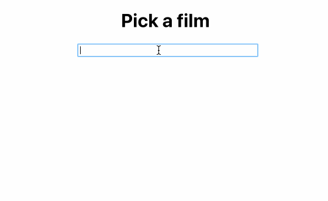

# Reusable React
A ongoing project where I intend to add reusable components and hooks

## Components
Check out the components directory for:  
`<AutoComplete />` - an input field that uses a Trie to provide rapid autocomplete suggestions  

## Hooks
Check out the hooks directory for:  
`useHover` - a hook that returns a boolean when the referenced component is being hovered over

## Created By
Henry Black - [Github](https://github.com/blackhaj) | [LinkedIn](https://www.linkedin.com/in/henryblack1/)

## License
Licensed under MIT, see [LICENSE](./LICENSE)